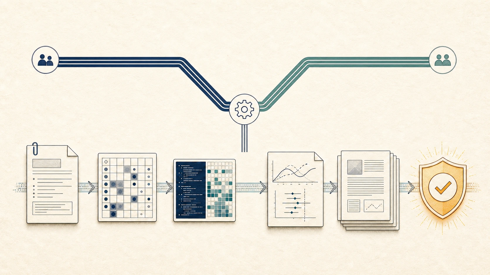
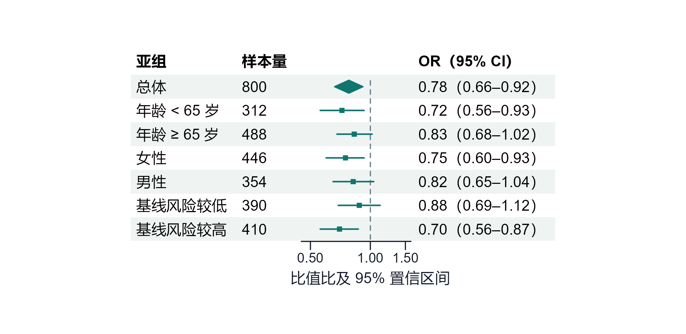
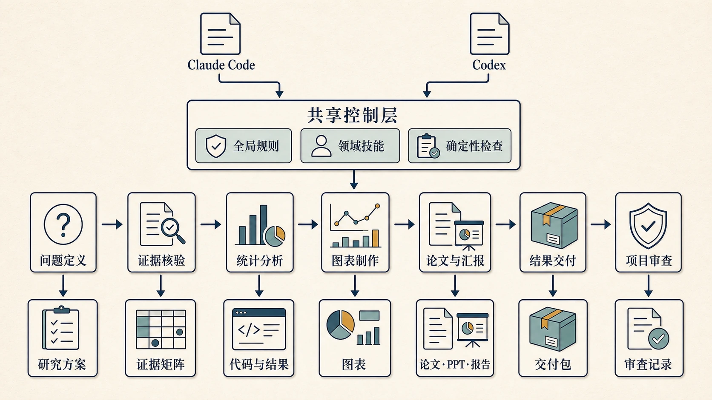
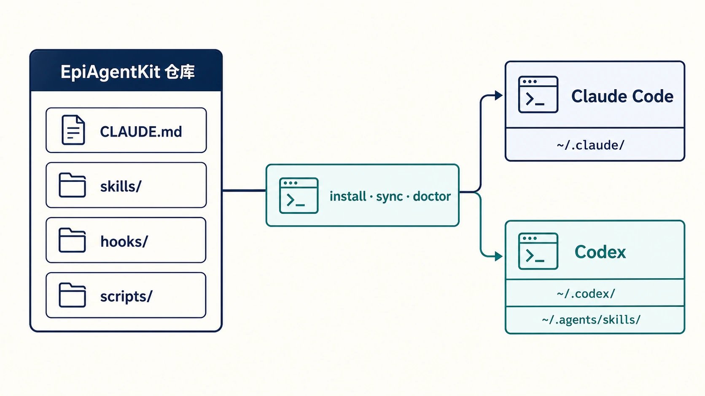

<div align="center">

# EpiAgentKit

**把流行病学与卫生统计研究流程，变成 Claude Code 和 Codex 可执行、可复核、可交付的工作流。**

Shared research workflow kit for Claude Code and Codex, built for epidemiology and biostatistics.

[](https://code.claude.com/docs)
[](https://openai.com/codex/)


[30 秒安装](#30-秒安装) · [项目能做什么](#项目能做到什么) · [真实 Demo](#从一句话到真实产物) · [完整工作流](#一张图看懂完整项目) · [双平台架构](#它如何工作) · [安全边界](#安全边界) · [维护指南](#维护与贡献)

</div>



> EpiAgentKit 不是新的统计软件，也不是一组万能提示词。它是一套面向科研 Agent 的规则、技能、工具和确定性检查，让研究者能够在同一套约束下组织项目、运行分析、制作成果并完成审查。

| 按任务加载 | 证据与结果单源 | 双平台一致 |
| --- | --- | --- |
| 只调用当前任务需要的 skill，不把整套规范塞进每次对话 | 来源、统计口径和结果数字都有明确锚点，不靠模型记忆补齐 | Claude Code 与 Codex 从同一仓库安装、同步并接受相同检查 |

## 项目能做到什么

只需要描述当前任务，EpiAgentKit 会按任务类型加载必要 skill，并将结果落到可检查的文件、代码或交付物中。

统计分析以 R 为主要和默认路径，标准研究工作流不要求用户具备 Python 环境。Python 仅作为明确选择或既有 Python 项目的可选补充；R 环境或依赖缺失时先报告影响，不自动改用 Python，也不迁移可工作的 R 主流程。

| 研究任务 | 它会做什么 | 典型产物 |
| --- | --- | --- |
| 新建研究项目 | 默认建立 R 标准目录，也可按明确选择建立 Python 目录，并生成研究方案、统计分析计划、结果单源、表图 registry 与归档约定 | 可直接开工的研究或咨询项目骨架 |
| 核验文献与方法依据 | 核对题名、作者、DOI/PMID、来源身份和撤稿状态，必要时组织正式证据检索 | 核验记录、证据矩阵、方法选择依据 |
| 完善研究设计与 SAP | 把研究想法转成 PICO/PECO、estimand、终点、时间零点、偏倚控制、样本量或精度依据及预设分析 | 可审查的 PROTOCOL、SAP、未决事项与设计备忘录 |
| 完成 R 统计分析 | 执行数据清洗、描述统计、回归、生存分析、中介分析与 Meta 分析，并按 `PLAN-CODE-RUN-VERIFY-DOC` 闭环 | 可复现 R 脚本、结果对象、Excel 表格与方法记录 |
| 完成明确选择的 Python 统计分析 | 在用户指定 Python 或既有 Python 项目中执行数据清洗、描述统计、回归、生存分析、预测验证与异常核查，并与 R 共用结果单源 | 可复现 Python 脚本、结果对象、表图与方法记录 |
| 制作发表级统计图 | 按真实数据和最终物理尺寸生成森林图、生存曲线、ROC、热图、回归诊断等结果图 | PDF、PNG 或 SVG 图件及对应出图代码 |
| 生成科研非统计视觉 | 为论文、PPT、标书、报告、README 和技术文档生成流程、路线、框架、机制与图形摘要，并区分内容图、真实截图和氛围图 | 经来源、结构、文字和最终载体复核的完整图件 |
| 写论文与投稿材料 | 基于项目已有结果起草中英文论文部件、学位论文、Cover Letter、Highlights 和审稿回复，并执行证据约束审校 | Markdown 或 Word 稿件、投稿材料与自检记录 |
| 写报告与制作学术汇报 | 把分析结果转成面向读者的报告，或基于中山大学模板生成组会、开题、答辩与正式汇报 | 报告正文、DOCX、可直接汇报的 PPTX |
| 打包统计咨询结果 | 把已验证的分析整理为客户可独立阅读、复现和复核的外发包 | 自包含交付目录、说明文档、表图与运行入口 |
| 全项目质量审查 | 从项目骨架、数据链、代码、结果一致性、科学合理性和交付一致性六层收集证据 | 带 ERROR/WARN 的审查结果与修复清单 |
| 处理常见科研文件 | 在内容主流程之外读取、编辑、验证和转换 Word、PowerPoint、Excel 与 PDF | `.docx`、`.pptx`、`.xlsx`、`.pdf` 等实际文件 |

### 你可以直接这样提需求

```text
在这个现有队列项目中完成 Cox 回归和森林图，并核对全部 warning。

快速核验这条 DOI 的题名、作者与撤稿状态，不做系统综述。

根据 results.yaml 起草结果与讨论，生成 Word 稿，并检查数字一致性。

全面审查这个项目的命名、代码、结果、论文和交付包是否一致。
```

## 从一句话到真实产物

下面的森林图不是概念插图或生成式界面，而是使用仓库的统计出图规则在固定合成数据上实际运行后导出的产物。示例只用于验证工作流和文件输出，不代表真实医学结论。

**输入**

```text
使用合成示例数据生成一张亚组森林图，展示比值比及 95% 置信区间；
同时导出 PDF 和 300 DPI PNG，并核对字体、参考线、置信区间和异常输出。
```

**实际输出**

<picture>
  <source media="(max-width: 600px)" srcset="docs/demo/output/forest-plot-mobile.png">
  
</picture>

`biostat-principles → publication-figures` 负责口径、数值验证、物理尺寸、中文字体和 PDF/PNG 双格式导出。[查看 PDF](docs/demo/output/forest-plot.pdf) · [查看复现脚本](docs/demo/generate_forest_demo.R) · [查看示例数据](docs/demo/forest-demo-data.csv)

## 一张图看懂完整项目



Claude Code 与 Codex 共用一个控制层：全局规则约束行为，领域技能提供任务工作流，确定性检查保护关键边界。控制层贯穿从问题定义到项目审查的完整生命周期，每一阶段都留下可继续使用和复核的明确产物。

| 阶段 | EpiAgentKit 的检查要求 |
| --- | --- |
| 问题定义 | 先锁定 PICO/PECO、estimand、时间零点、分组、终点、纳排标准、分析集与主分析口径 |
| 证据核验 | 核验来源身份，区分已核验事实、合理推断和待补证据 |
| 统计分析 | 代码必须实跑，输出必须存在，异常必须全量扫描并逐项归因 |
| 图表制作 | 统计数据图、非统计视觉和原始科研证据按属性分流，图件在最终载体中复核 |
| 论文与汇报 | 统计数字来自机器单源，论文、报告、PPT 和图表不手敲关键结果 |
| 结果交付 | 交付包保持自包含、可独立阅读、可复现，并与主流程结果一致 |
| 项目审查 | ERROR 阻止签发，WARN 逐项解释，工作区保留可复现与可追溯证据 |

## 它如何工作

EpiAgentKit 把 Agent 的行为分成四层，仓库是 Claude Code 与 Codex 的共同配置源。



| 层 | 组件 | 作用 |
| --- | --- | --- |
| 全局规则 | [`CLAUDE.md`](CLAUDE.md) | 常驻每个会话的硬红线、任务路由、单源指针与完成条件 |
| 领域技能 | [`skills/`](skills/) | 按需加载分析、证据、写作、视觉、交付与审查流程，避免把所有规范塞进上下文 |
| 确定性 hooks | [`hooks/`](hooks/) | 保护原始数据，检查 R 语法、文本痕迹、图件与结果文件 |
| 配置管理器 | [`scripts/epiagentkit.py`](scripts/epiagentkit.py) | 安装、同步、冲突清理、双端一致性验收与项目终检 |

### 两种任务模式

| 模式 | 什么时候使用 | 系统行为 |
| --- | --- | --- |
| 轻量任务 | 简单作业、单次处理、快速核验或只要一个小结果 | 只调用必要 skill，读写必要文件，执行与风险相称的最小验证，不创建完整项目账本 |
| 正式项目 | 明确初始化、投稿、咨询交付，或已处于标准研究项目 | 启用方案、分析、结果单源、日志、归档、registry 与最终审查契约 |

触发某个领域 skill 不会自动把轻量任务升级为正式项目。只有文件布局和研究治理确实需要时，才进入完整契约。

## 30 秒安装

配置管理器需要 Python 3.10 或更高版本。R 仅在运行 R 分析、R 统计图或 officer PPT 时需要；Python 统计分析复用用户项目中已准备的兼容环境和依赖，EpiAgentKit 不代为安装或升级。

```bash
git clone https://github.com/KangWang42/EpiAgentKit.git
cd EpiAgentKit
python scripts/epiagentkit.py install
```

Git 不是运行 EpiAgentKit 的必需条件。没有 Git 时可下载并解压仓库源码后运行同一安装命令；Agent 会跳过版本管理，不会初始化仓库或安装 Git。

交互式安装会询问目标平台和导入范围，结束后自动运行 `doctor`。已有个人配置会保留，只有同名 EpiAgentKit 文件与受管 hook 会被更新。

### 常用安装方式

```bash
# Claude Code 与 Codex 完整安装
python scripts/epiagentkit.py install --target all --preset full --yes

# 只安装统计分析技能包
python scripts/epiagentkit.py install --target all --preset analysis --yes

# 只安装论文与报告技能包
python scripts/epiagentkit.py install --target all --preset writing --yes

# 只为 Codex 安装 PPT 与科研视觉技能包
python scripts/epiagentkit.py install --target codex --preset ppt --yes

# 先演练，不修改用户目录
python scripts/epiagentkit.py install --target all --preset full --yes --dry-run
```

<details>
<summary><strong>同步、自选技能与验收命令</strong></summary>

```bash
# 从仓库同步已安装内容，并复核 Claude Code 与 Codex 一致性
python scripts/epiagentkit.py sync --target all
python scripts/epiagentkit.py doctor --target all

# 查看预设与可分发技能
python scripts/epiagentkit.py list

# 自选技能，依赖项自动补齐
python scripts/epiagentkit.py install --target all --preset custom \
  --skills sysu-ppt,report-writing --with-rules --yes

# 对正式研究项目运行确定性签发预检
python scripts/epiagentkit.py check-project <项目根>
```

Codex 默认把自定义 skills 安装到官方目录 `~/.agents/skills/`。`--codex-layout codex` 与 `both` 仅用于兼容旧布局，并会提示重复技能风险。

</details>

## 能力地图

| 类型 | Skills |
| --- | --- |
| 原则、证据与设计 | `biostat-principles` · `evidence-research` · `epi-study-design` |
| 项目与分析 | `project-init` · `r-biostats` · `python-biostats` · `publication-figures` |
| 科研视觉 | `research-visuals` · `svg-diagrams` |
| 论文与报告 | `academic-publishing` · `academic-humanizer` · `report-writing` |
| 汇报与交付 | `sysu-ppt` · `consulting-delivery` |
| 项目审查 | `epi-project-audit` |
| 文件与维护 | `docx` · `pdf` · `pptx` · `xlsx` · `epiagentkit-maintenance` · `skill-creator` · `git-commit-helper` |

组合遵循“最小内容主流程 → 必要的视觉或文件操作 → 终审”。研究设计使用 `biostat-principles → epi-study-design`；统计分析默认转 `r-biostats`，仅在用户明确选择或既有 Python 项目中转 `python-biostats`，实际出统计图时再加 `publication-figures`；论文从零生成使用 `academic-publishing → academic-humanizer`，需要 Word 时再加 `docx`；非统计视觉统一使用 `research-visuals → imagegen`，并仅按其明确条件回退到 `svg-diagrams`。

## 为什么不只是一个提示词仓库

- **原始数据只读**：`01_data/rawdata/` 与项目声明的其它原始根不得被 Agent 修改。
- **口径先于模型**：分组、终点、纳排和主分析存在多个合理定义时，必须先澄清。
- **数字机器单源**：正式项目以 `07_paper/results.yaml` 保存结果数字，再派生人读摘要并供下游取数。
- **代码必须实跑**：不以退出码或日志尾部代替核验，必须全量扫描 `error|warning|traceback|failed|nan`。
- **探索与主线隔离**：新方法先在备份区公平对照，满足预设的主流程纳入条件后才能进入正式流程。
- **当前版保持唯一**：稳定语义名只保留一组当前交付物，旧版按批次归档并可检索。
- **双平台共用正文**：Claude Code 和 Codex 读取同一份规则与技能，不维护两套容易漂移的内容。

## 安全边界

| EpiAgentKit 会做 | EpiAgentKit 不会做 |
| --- | --- |
| 依据项目文件、真实分析结果和可核验来源推进任务 | 编造研究发现、文献、DOI/PMID、伦理号、基金号或期刊要求 |
| 在授权范围内整理非原始文件、运行代码、生成成果并审查 | 修改原始数据，或在数据异常未闭环时擅自填补、排除和继续计算 |
| 把观察性结果校准为合适的论断强度 | 把关联写成已证实因果，或把探索性峰值包装成最终结论 |
| 用 hooks 和项目审查减少可预防错误 | 替代研究者对设计、临床意义、统计口径和最终签发的责任 |

全局规则授予 Agent 较大的项目整理权限，可能移动、归档或重排非原始文件。Git 可用时建议用它保留可回退历史；没有 Git 时应先自行备份重要数据，工作流会跳过 Git，不会代为安装。项目约定来自作者的研究与咨询实践，不是领域唯一标准，可按团队规范删改。

## 维护与贡献

维护本仓库时先使用 `epiagentkit-maintenance`。优化不是只增不减：先确认要保留的旧行为，再决定重写、合并、下沉、脚本化、删除或新增，并用新旧代表性场景共同回归。修改规则、skills、hooks 或安装器后，至少运行：

```bash
python scripts/audit_skill_contracts.py
python scripts/audit_workflow_contracts.py
python -m unittest discover -s scripts/tests -p "test_*.py"
python scripts/epiagentkit.py sync --target all
python scripts/epiagentkit.py doctor --target all
```

行为发生变化时，还需要对受影响的 R、Python 或 Bash 脚本做语法检查和代表性实跑。详细 contributor 约定见 [`AGENTS.md`](AGENTS.md)，全局规则迁移说明见 [`docs/global-rule-migration.md`](docs/global-rule-migration.md)。

<details>
<summary><strong>参考来源与许可证说明</strong></summary>

Skill 路由与维护合同参考了 GitHub [awesome-copilot skills 固定提交 `dae77f2`](https://github.com/github/awesome-copilot/tree/dae77f24132c1d686c30fd5b29aee0d63668d1d2/skills) 中的最小兼容 skill 栈、输入—操作—输出匹配、可观察成功条件、基线验证和渐进披露模式。EpiAgentKit 只吸收这些通用设计原则，不复制其长篇通用 playbook、破坏性 Git 操作或与流行病学证据链冲突的固定流程。

`research-visuals` 借鉴并重新实现了 [TingxiYu/academic-figure-skill](https://github.com/TingxiYu/academic-figure-skill) 与 [LigphiDonk/academic-figure-generator](https://github.com/LigphiDonk/academic-figure-generator) 中的问题驱动图前合同、来源映射和多轮质量检查。仓库只归档选定的开源参考文档与提示词，没有引入其生产脚本、示例图片或第三方 API 配置。完整来源、固定快照、许可证与 SHA-256 见 [`external/SOURCE.md`](skills/research-visuals/references/external/SOURCE.md)。

`docx`、`pdf`、`pptx`、`xlsx` 与 `skill-creator` 来自 [anthropics/skills](https://github.com/anthropics/skills)，各目录保留原始 LICENSE。`sysu-ppt` 内置模板版权归中山大学所有，仅供学习参考，可删除模板后替换为自有资产。

</details>

---

<div align="center">

如果你希望科研 Agent 不只“给答案”，而是留下可运行、可复核、可交付的完整证据链，EpiAgentKit 就是为此设计的。

</div>
